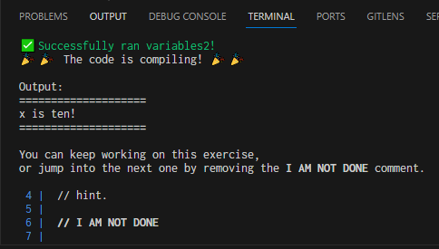
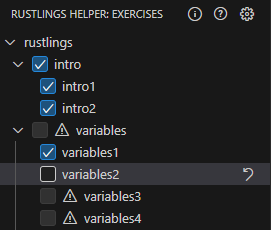

# Rustlings Helper

A helper extension for the Rustlings exercises. It doesn't do the exercises for you, it does everything the Rustlings CLI does but inside the VSCode IDE. And plenty more!

## Features

* Shows the equivalent of `rustlings watch` in the VSCode terminal.
  
* Always shows the output for the exercise you have open.
* Updates the output if the file you have open changes for any reason.
* Automatically opens the next exercise when the current one compiles, runs, and passes tests and is marked as done.
* Can show the provided hint for the exercises.
* Can show the README for the sections of exercises.
* Hotkey for marking an exercise as done or not done. (`Ctrl+Alt+D` or `Ctrl+Cmd+D`)
* Shows a tree view of the exercises, with their status. 
  
  
  The checkbox indicates whether or not an exercise is marked as done. The warning icon means that the exercise does not compile, run, or pass tests. You can use the section checkboxes to mark/unmark an entire section in one go.

  The status is always updated when the exercises' files change, even if not open in an editor.
* Button and command (not bound to a hotkey by default) to reset an exercise to its initial state. This uses the `rustlings reset` command, which in turn uses `git stash`. You'll be able to recover your work from git stashes.

## Requirements

You need to have [Rustlings installed](https://github.com/rust-lang/rustlings#getting-started). 

## Extension Settings

This extension contributes the following settings:

* `rustlingsHelper.showWalkthrough`: Whether to show the walkthrough messages for the `intro` exercises.
* `rustlingsHelper.startup.setupLSP `: Whether to create the `rust-project.json` file on startup if it doesn't exist yet. This file allows for instance [Rust Analyzer](https://marketplace.visualstudio.com/items?itemName=rust-lang.rust-analyzer) to be used for the exercises. However, if you want to work on the source for Rustlings itself, you should either disable this setting or this extension as a whole.
* `rustlingsHelper.startup.startWatch`: Whether to show the built-in watch terminal on startup. This extension emulates the output of `rustlings watch` in the terminal, but it can be disabled here if you prefer to use the real `rustlings watch` command instead.

## Known Issues

Calling out known issues can help limit users opening duplicate issues against your extension.

## Release Notes

Users appreciate release notes as you update your extension.

### 0.1.0

Preview release of the Rustlings Helper extension.
